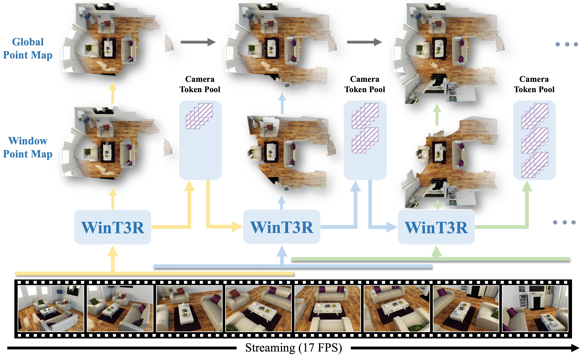

# WinT3R: Window-Based Streaming Rrconstruction With Pool Camera Tokens
[](https://github.com/LiZizun/WinT3R)
[](https://huggingface.co/lizizun/WinT3R)

Official implementation of **WinT3R** - a online model that infers precise camera pose and high-quality point map for image streams.




<!-- TOC start (generated with https://github.com/derlin/bitdowntoc) -->

- [📖 Overview](#-overview)
- [🛠️ TODO List](#-todo-list)
- [🌍 Installation](#-installation)
- [💿 Checkpoints](#-checkpoints)
- [🎯 Run Inference from Command Line](#-run-inference-from-command-line)
- [📜 Citation ](#-citation)

<!-- TOC end -->

## 📖 Overview
We present WinT3R, a feed-forward model that infers precise camera pose and high-quality point map for image stream in an online manner. Our main contributions are summarized as follows:

1. **We propose an online window mechanism,** enabling sufficient interaction of image tokens
within the same window and across adjacent windows.
2. **We maintain a camera token pool,** which functions as a lightweight ”global memory” and
improves the quality of camera pose prediction with a global perspective.
3. **We achieve state-of-the-art performance,** experiments demonstrate that WinT3R achieves state-of-the-art performance in online 3D reconstruction and camera pose estimation, with the fastest reconstruction speed to date.

## 🛠️ TODO List
- [x] Release point cloud and camera pose estimation code.
- [ ] Release evaluation code.
- [ ] Release training code.
- [ ] Release data processing code.

## 🌍 Installation

```
conda create -n WinT3R python=3.10
conda activate WinT3R
pip install torch==2.5.1 torchvision==0.20.1 torchaudio==2.5.1 --index-url https://download.pytorch.org/whl/cu118  # use the correct version of cuda for your system
pip install -r requirements.txt
```


## 💿 Checkpoints
Download the checkpoint from [huggingface](https://huggingface.co/lizizun/WinT3R/resolve/main/pytorch_model.bin) and place it in the checkpoints/pytorch_model.bin directory.

## 🎯 Run Inference from Command Line


```bash
# Run with default example video
python recon.py

# Run on your own data (image folder or .mp4 file)
python recon.py --data_path <path/to/your/images_dir>
```


## 📜 Citation 
```bibtex
@misc{zhang2025flarefeedforwardgeometryappearance,
      title={FLARE: Feed-forward Geometry, Appearance and Camera Estimation from Uncalibrated Sparse Views}, 
      author={Shangzhan Zhang and Jianyuan Wang and Yinghao Xu and Nan Xue and Christian Rupprecht and Xiaowei Zhou and Yujun Shen and Gordon Wetzstein},
      year={2025},
      eprint={2502.12138},
      archivePrefix={arXiv},
      primaryClass={cs.CV},
      url={https://arxiv.org/abs/2502.12138}, 
}
```
## 🙏 Acknowledgement
WinT3R is constructed on the outstanding open-source projects. We are extremely grateful for the contributions of these projects and their communities, whose hard work has greatly propelled the development of the field and enabled our work to be realized.

- [DUSt3R](https://dust3r.europe.naverlabs.com/)
- [MASt3R](https://github.com/naver/mast3r)
- [CUT3R](https://github.com/CUT3R/CUT3R)
- [VGGT](https://github.com/facebookresearch/vggt)
- [Pi3](https://yyfz.github.io/pi3/)